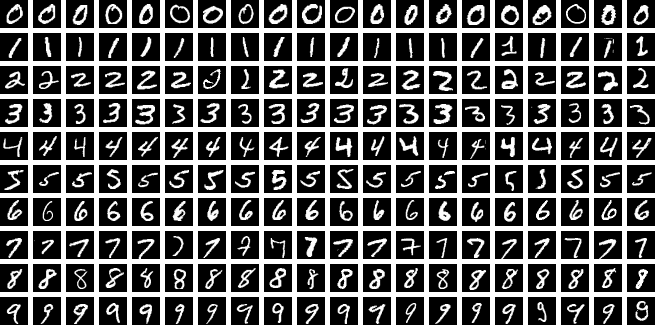

# Red Neuronal Fundamentos - MNIST

[Readme English version](README.MD)

Este repositorio contiene un proyecto de **red neuronal** implementada desde cero en **NumPy**, enfocado en el dataset MNIST para el reconocimiento de dígitos. El objetivo es profundizar en cada parte de la arquitectura de la red, implementando **forward pass** y **backward pass** manualmente sin el uso de frameworks como TensorFlow o PyTorch.



---

## Estructura de Archivos y Carpetas

```
NeuralNetwork-Fundamentals-MNIST/
├─ MNIST_db/
│  ├─ process_MNIST.ipynb
│  └─ raw/
│     ├─ t10k-images-idx3-ubyte.gz
│     ├─ t10k-labels-idx1-ubyte.gz
│     ├─ train-images-idx3-ubyte.gz
│     └─ train-labels-idx1-ubyte.gz
├─ README.md
├─ RedNeuronal.ipynb
├─ get_images_script.py
```

- **`RedNeuronal.ipynb`**  
  Notebook principal donde se desarrolla todo el código para:
  - Cargar los datos de MNIST (haciendo uso de `get_images_script.py`).
  - Normalizar y dividir en entrenamiento, validación y prueba.
  - Definir las clases `Linear`, `ReLU`, `Sequential_layers` y la clase auxiliar `np_tensor`.
  - Entrenar la red neuronal.
  - Evaluar los resultados de precisión (_accuracy_).

- **`get_images_script.py`**  
  Script que contiene la función `get_images(mnist_raw_path)`, encargada de cargar los archivos de MNIST desde la carpeta `MNIST_db/raw/` y devolver los arrays NumPy con las imágenes y etiquetas.

- **`MNIST_db/raw/`**  
  Carpeta con los archivos comprimidos de MNIST (`.gz`).  
  - `train-images-idx3-ubyte.gz`, `train-labels-idx1-ubyte.gz`  
  - `t10k-images-idx3-ubyte.gz`, `t10k-labels-idx1-ubyte.gz`

- **`MNIST_db/process_MNIST.ipynb`**  
  Notebook adicional (opcional) donde se puede ejecutar algún preprocesamiento o ver detalles sobre cómo se obtienen los archivos `gz` y se convierten a arrays.

---

## Instrucciones de Uso

1. **Clona** el repositorio:
   ```bash
   git clone https://github.com/PabloSanchez87/NeuralNetwork-Fundamentals-MNIST.git
   ```
2. **Instala** las dependencias necesarias (idealmente en un entorno virtual):
   ```bash
   pip install -r requirements.txt
   ```
3. **Comprueba** que los archivos de MNIST (`.gz`) estén en la carpeta `MNIST_db/raw`.  
4. **Abre** el notebook principal:
   ```bash
   jupyter notebook RedNeuronal.ipynb
   ```
5. **Ejecuta** las celdas en orden:
   - Se cargarán y descomprimirán las imágenes de MNIST.
   - Se mostrará el proceso de normalización y la arquitectura de la red.
   - Se iniciará el entrenamiento y podrás observar en pantalla la evolución de la pérdida (_cost_) y la precisión (_accuracy_).

---

## Descripción de la Red Neuronal

- **Arquitectura**:  
  - Capa densa `Linear(784, 200)` con activación `ReLU`.  
  - Capa densa `Linear(200, 10)` para clasificación en 10 dígitos (0-9).

- **Función de Pérdida**:  
  - `softmax` + _cross-entropy_.

- **Backprop Manual**:
  - Se implementa cada gradiente en `Linear.backward` y `ReLU.backward`.
  - Se utiliza una clase `np_tensor` para manejar el atributo `.grad` y facilitar el cálculo de gradientes sin frameworks.

- **Entrenamiento**:
  - Se define un generador de mini-lotes (`create_minibatches`) para procesar los datos en bloques.
  - En cada _epoch_, se calculan los gradientes y se hace _update_ de los pesos con **gradiente descendente**.

---

## Resultados Esperados

Ejecutando el código en `RedNeuronal.ipynb`, verás la salida por época, por ejemplo:
```
Epoch 1 - Cost: 0.35, accuracy: 0.90
Epoch 2 - Cost: 0.27, accuracy: 0.92
...
Epoch 20 - Cost: 0.10, accuracy: 0.96
```
Se logra una precisión cerca del **96-97 %** en validación con esta arquitectura sencilla.

---

## Personalización

- **Capas**: Puedes añadir más capas `Linear` y `ReLU` para crear una red más profunda.
- **Hiperparámetros**: Ajusta el _learning rate_, tamaño de mini-lotes (`mb_size`), número de épocas, etc.
- **Preprocesamiento**: Modifica la forma en que normalizas o aplicas técnicas de _data augmentation_ (en MNIST, no es tan habitual, pero podría hacerse).

---

## Reconocimientos

- Un agradecimiento especial al canal de YouTube [Pepe Cantoral PhD](https://www.youtube.com/@PepeCantoralPhD) por brindar videos y conocimientos que fueron de gran ayuda en la creación de este proyecto.

---

## Contribuciones

Si deseas **colaborar**, puedes abrir _issues_ para sugerencias, o directamente hacer _pull requests_ con mejoras o correcciones.

---
